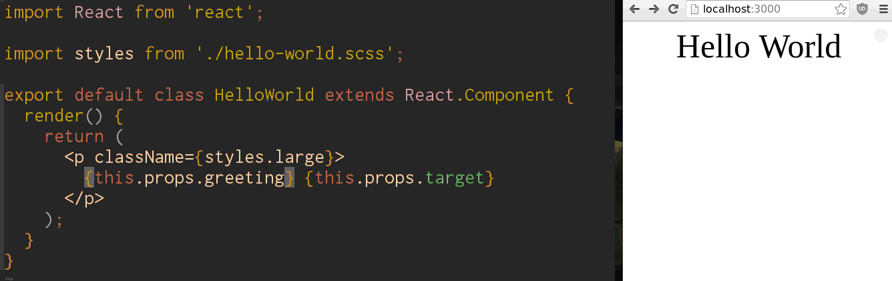
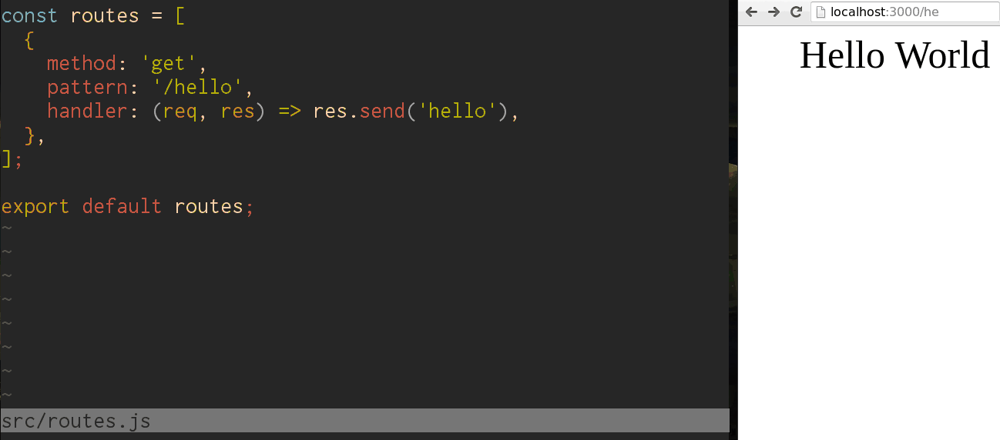
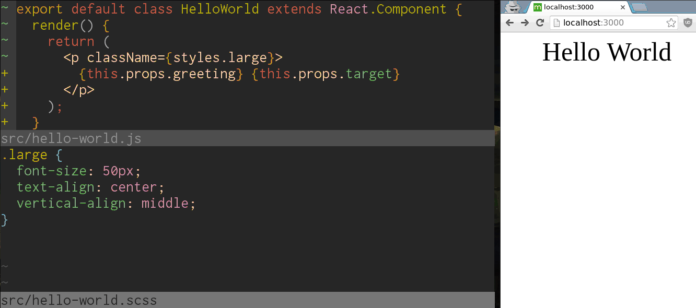

# STUCCO

> Low Friction Rapid Prototyping For ReactJS


Given the incidental complexity of setting up a new environent for a ReactJS component, this tool gives a (very!) opinionated stack for rapid prototyping. Recently the vast majority of the work I've been doing has been focused on building ReactJS components, distributed as individual modules in their own git repositories and npm modules. This means that for every module, the beginning is either manually creating the project structure or cloning a boilerplate. In both cases, keeping all the (at this point 100+) projects in sync with configuration and process is an exponentially difficult task. The hope is that with this tool, scaffolding a default project and keeping it's tooling up to date should be simple.

## Table of Contents

- [Why Stucco](#whystucco)
- [Features](#features)
- [Usage](#usage)

## Why Stucco?

- Simple and easy to use
- Low Friction: gets out of your way immediately so you can start building rather than configuring
- Extensible: so you don't have to rebuild your tools with every new dependency or configuration change
- Rapid Prototyping: Livereload, HMR, devtools (fixture switching, test and lint status)

This tool is purely focused on building self-contained modules not full applications. If you're looking for a build tool aimed at scaffolding and prototyping server/client application, take a look at [React Project](https://github.com/ryanflorence/react-project).

## Features

### HMR



### Extensible Routes



### Fixtures Swapper


### CSS Modules



## Usage

### Create a new project and add Stucco as a dev-dependency

```console
$ mkdir my-awesome-project
$ cd my-awesome-project
$ npm init
$ npm install -SD stucco
# you should only run scaffold once, at the beginning of your development
# it will not run if there is an existing .stuccorc file, to avoid overwriting your work
$ ./node_modules/.bin/stucco scaffold

# this command will create a
#   .stuccorc
#   src/index.js
#   src/fixtures.js
#   src/routes.js
# and add the following tasks to your package.json
#   watch
#   build
#   distribute
```

```js
//package.json
{
  ...
  "scripts": {
    "watch": "stucco watch", // runs a server that serves the component file, watching for changes and hot-reloading
    ...
  },
  ...
}
```

```js
// .stuccorc
{
  // if any of the following are missing from this file, they will default to the values seen here

  // change the fixtures value to point to the file you want to store the fixtures in
  "fixtures": "src/fixtures.js",
  // change the component value to point to the file you want to store your top level component in
  "component": "src/index.js",
  // change the routes value to point to the file you want to store your server routes in
  "routes": "src/routes.js"
}
```

```js
// src/index.js
import React from 'react';

// edit me!
export default class Component extends React.Component {
  render(
    <span>{this.props.greeting} {this.props.target}</span>
  );
}
```

```js
// src/fixtures.js
const fixtures = [
  // label must be unique
  { label: '01', props: { greeting: 'Hello', target: 'World' } },
  { label: '02', props: { greeting: 'Goodbye', target: 'World' } },
];

export default fixtures;
```

```js
// src/routes.js
const routes = [
  // method: the HTTP method: [get, post, patch, put, delete, *]
  // pattern: the pattern to match for the route
  // handler: the express route handler function
  {
    method: 'get',
    pattern: '/hello',
    handler: (req, res) => res.send('hello'),
  },
];

export default routes;
```

